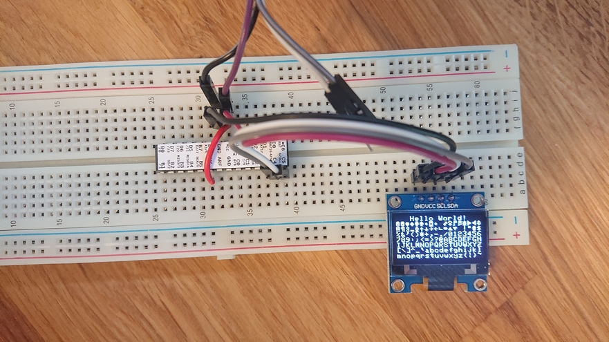

# OLED Experiments

I bought [these](https://banggood.app.link/nO5rGtZfphb) OLED screens
and wanted to see why they weren't working on my existing I²C setup,
when my other OLED screens were.

It turns out they don't support `horizontal memory mode`. You can read
more about it [here](http://www.technoblogy.com/show?2CFT).

I'm just putting this code out there in case I need it in the future,
or in the less likely case of someone else needs it. If you want to
test your OLED screen without any Arduino-dependencies, this might be
helpful.

The displays, unfortunately, have literally no labels. No
manufacturer, no model, no part number. So I don't know what I've
got. But it seems to be running the SH1106 chip since horizontal
memory mode doesn't work, based off of the blob mentioned above.
